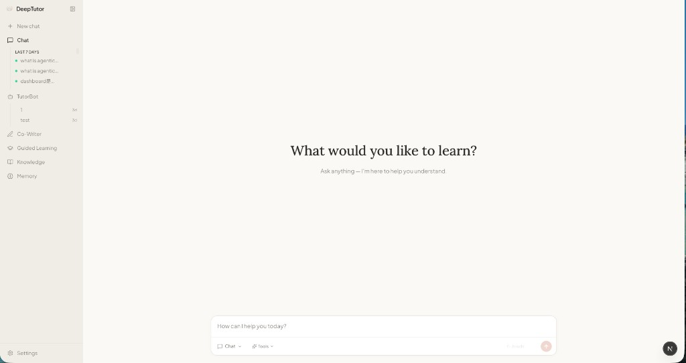

<div align="center">


# DeepTutor

**Your AI-Powered Learning Companion**

[](https://www.python.org/downloads/)
[](https://nextjs.org/)
[](LICENSE)

<p>
  <a href="https://discord.gg/eRsjPgMU4t"></a>
  &nbsp;
  <a href="./Communication.md"></a>
  &nbsp;
  <a href="https://github.com/HKUDS/DeepTutor/issues/78"></a>
</p>

[Features](#-features) · [Get Started](#-get-started) · [Explore](#-explore-deeptutor) · [Community](#-contributing)

[🇨🇳 中文](assets/README/README_CN.md) · [🇯🇵 日本語](assets/README/README_JA.md) · [🇪🇸 Español](assets/README/README_ES.md) · [🇫🇷 Français](assets/README/README_FR.md) · [🇸🇦 العربية](assets/README/README_AR.md) · [🇷🇺 Русский](assets/README/README_RU.md) · [🇮🇳 हिन्दी](assets/README/README_HI.md) · [🇵🇹 Português](assets/README/README_PT.md)

</div>

DeepTutor is an open-source intelligent learning platform that goes far beyond simple Q&A. It brings together conversational AI, personal tutoring agents, knowledge management, and adaptive learning into a unified experience — designed for learners who want depth, not just answers.

<div align="center">
  
</div>

---

## ✨ Features

- **Unified Chat Workspace** — Five powerful modes (Chat, Deep Solve, Quiz Generation, Deep Research, Math Animator) sharing the same context. Switch freely, as you wish.
- **Personal TutorBots** — Autonomous AI tutors with their own workspace, memory, and personality. They set reminders, learn new skills, and grow alongside you.
- **AI Co-Writer** — A Markdown editor with AI deeply woven in. Rewrite, expand, summarize — with full access to your knowledge base and the web.
- **Guided Learning** — Multi-step visual learning plans built from your own materials. Each step becomes an interactive page you can explore and discuss.
- **Knowledge Hub** — Upload documents, build knowledge bases, organize notebooks. Your personal learning infrastructure, always at your fingertips.
- **Persistent Memory** — DeepTutor remembers your learning journey — progress, preferences, and goals. The more you use it, the better it understands you.

---

## 🚀 Get Started

### Install

```bash
git clone https://github.com/HKUDS/DeepTutor.git
cd DeepTutor

# Create environment
conda create -n deeptutor python=3.10 && conda activate deeptutor
# Or: python -m venv venv && source venv/bin/activate

# Install core + web
pip install -e ".[server]"
```

### Configure

DeepTutor offers two ways to get configured:

**Terminal — Interactive Setup**

```bash
python scripts/start_tour.py
```

A guided installer that walks you through port selection, LLM/embedding provider setup, and `.env` generation — all from your terminal.

**Web — Guided Tour**

Launch the app and head to **Settings**. A four-step onboarding tour will spotlight each configuration section — LLM, Embedding, Search, and system verification — so you can get everything running without leaving the browser.

### Launch

```bash
python scripts/start_web.py
```

Open [http://localhost:3782](http://localhost:3782) and start learning.

<details>
<summary><b>Start services separately</b></summary>

```bash
# Backend (FastAPI)
python -m deeptutor.api.run_server

# Frontend (Next.js)
cd web && npm install && npm run dev -- -p 3782
```

| Service | Port |
|:---:|:---:|
| Backend | `8001` |
| Frontend | `3782` |

</details>

<details>
<summary><b>Environment variables reference</b></summary>

| Variable | Required | Description |
|:---|:---:|:---|
| `LLM_BINDING` | **Yes** | LLM provider (`openai`, `anthropic`, etc.) |
| `LLM_MODEL` | **Yes** | Model name (e.g. `gpt-4o`) |
| `LLM_API_KEY` | **Yes** | Your LLM API key |
| `LLM_HOST` | **Yes** | API endpoint URL |
| `EMBEDDING_BINDING` | **Yes** | Embedding provider |
| `EMBEDDING_MODEL` | **Yes** | Embedding model name |
| `EMBEDDING_API_KEY` | **Yes** | Embedding API key |
| `EMBEDDING_HOST` | **Yes** | Embedding endpoint |
| `EMBEDDING_DIMENSION` | **Yes** | Vector dimension |
| `SEARCH_PROVIDER` | No | Search provider (`tavily`, `jina`, `serper`, `perplexity`, etc.) |
| `SEARCH_API_KEY` | No | Search API key |
| `BACKEND_PORT` | No | Backend port (default `8001`) |
| `FRONTEND_PORT` | No | Frontend port (default `3782`) |

</details>

### CLI

DeepTutor ships as a lightweight CLI package — an agent-native interface to every capability:

```bash
deeptutor chat                                   # Interactive REPL
deeptutor run chat "Explain Fourier transform"   # One-shot query
deeptutor run deep_solve "Solve x^2 = 4"         # Deep problem solving
deeptutor kb list                                # List knowledge bases
deeptutor kb create my-kb --doc textbook.pdf     # Create from documents
deeptutor bot list                               # Manage TutorBots
deeptutor memory show                            # View learning memory
deeptutor serve --port 8001                      # Start API server
```

---

## 📖 Explore DeepTutor

### 💬 Chat — Your Unified Intelligent Workspace

The Chat workspace is where everything converges. Five distinct modes live under one roof, sharing a unified context management system — your conversation history, knowledge bases, and tool selections carry seamlessly across modes. Switch between them at will within the same topic.

| Mode | What It Does |
|:---|:---|
| **Chat** | Fluid conversation with optional tools — RAG retrieval, web search, code execution, deep reasoning, brainstorming, and paper search. Compose the exact toolkit you need. |
| **Deep Solve** | A multi-agent solver that plans, investigates, solves, and verifies — with precise source citations at every step. |
| **Quiz Generation** | Auto-generates assessments grounded in your knowledge base (Custom mode) or clones the style of uploaded reference exams (Mimic mode), with built-in validation. |
| **Deep Research** | Decomposes your topic into subtopics, dispatches parallel research agents with RAG + web + paper search, and synthesizes a fully cited academic-style report. |
| **Math Animator** | Transforms mathematical concepts into visual animations and storyboards. |

> **Unified Context**: Every mode reads from and writes to the same conversation thread. Start with a chat question, escalate to Deep Solve, generate quiz questions to test your understanding, then launch a Deep Research — all without losing context.

---

### 🤖 TutorBot — Your Personal AI Tutor

TutorBot is more than a chatbot — it's a persistent, autonomous tutor that lives in your workspace.

Each TutorBot instance is powered by an independent agent loop, equipped with its own **workspace**, **memory**, and **skill set**, while sharing a common memory layer with DeepTutor itself. Think of it as a real tutor who actually knows you.

- **Custom Soul** — Define your tutor's personality, communication style, and values through editable Soul templates. Make it encouraging, Socratic, rigorous, or anything in between.
- **Independent Memory** — Each bot maintains its own workspace files and conversation history, separate from other bots yet connected to DeepTutor's global memory.
- **Reminders & Scheduling** — Set up recurring check-ins, study reminders, and periodic tasks through the built-in heartbeat system.
- **DeepTutor Integration** — Bots can invoke DeepTutor's full capabilities: search your knowledge bases, run code, browse the web, and more.
- **Skill Learning** — Extensible through skill files — teach your bot new abilities by adding skill definitions to its workspace.

---

### ✍️ Co-Writer — AI Meets Your Markdown Editor

Co-Writer takes the intelligence of Chat and embeds it directly into a writing environment. It's a full-featured Markdown editor where AI is a first-class collaborator, not an afterthought.

Select any text and choose **Rewrite**, **Expand**, or **Shorten** — optionally pulling context from your knowledge base or the web to enrich the output. The entire editing flow is non-destructive, with full undo/redo support.

Write drafts, annotate key concepts, and save finished pieces directly to your notebooks. Everything you create feeds back into your learning ecosystem.

---

### 🎓 Guided Learning — Visual, Step-by-Step Mastery

Guided Learning transforms your personal materials into structured, multi-step learning paths. Provide a topic and optionally link notebook records, and DeepTutor will:

1. **Design a learning plan** — Identify 3–5 progressive knowledge points from your materials.
2. **Generate interactive pages** — Each knowledge point becomes a rich, visual HTML page with explanations, diagrams, and examples.
3. **Enable contextual Q&A** — Chat alongside each learning step for deeper exploration.
4. **Summarize your progress** — Upon completion, receive a learning summary capturing what you've covered.

Each session is persistent — pause, resume, or revisit any step at any time.

---

### 📚 Knowledge — Your Learning Infrastructure

Knowledge is where you build and manage the document collections that power everything else in DeepTutor.

- **Knowledge Bases** — Upload PDF, TXT, or Markdown files to create searchable, RAG-ready knowledge bases. Add documents incrementally as your library grows.
- **Notebooks** — Organize learning records across sessions. Save insights from Chat, Guided Learning, Co-Writer, or Deep Research into categorized, color-coded notebooks.

Your knowledge base doesn't just store information — it actively participates in every conversation, every research session, and every learning path you create.

---

### 🧠 Memory — It Learns As You Learn

DeepTutor maintains a persistent, evolving memory of your learning journey through two complementary dimensions:

- **Summary** — A running digest of your learning progress: what you've studied, which topics you've explored, and how your understanding has developed over time.
- **Profile** — Your learner identity: preferences, knowledge level, goals, and communication style — automatically refined through every interaction.

Memory is shared across all of DeepTutor's features and your TutorBots. The more you learn with DeepTutor, the more personalized and effective it becomes.

---

## ⭐ Star History

<div align="center">

<p>
  <a href="https://github.com/HKUDS/DeepTutor/stargazers"></a>
  &nbsp;&nbsp;
  <a href="https://github.com/HKUDS/DeepTutor/network/members"></a>
</p>

<a href="https://www.star-history.com/#HKUDS/DeepTutor&type=timeline&legend=top-left">
  <picture>
    <source media="(prefers-color-scheme: dark)" srcset="https://api.star-history.com/svg?repos=HKUDS/DeepTutor&type=timeline&theme=dark&legend=top-left" />
    <source media="(prefers-color-scheme: light)" srcset="https://api.star-history.com/svg?repos=HKUDS/DeepTutor&type=timeline&legend=top-left" />
    
  </picture>
</a>

</div>

## 🤝 Contributing

<div align="center">

We hope DeepTutor becomes a gift for the community. 🎁

<a href="https://github.com/HKUDS/DeepTutor/graphs/contributors">
  
</a>

</div>

See [CONTRIBUTING.md](CONTRIBUTING.md) for guidelines on setting up your development environment, code standards, and pull request workflow.

## 🔗 Related Projects

<div align="center">

| [⚡ LightRAG](https://github.com/HKUDS/LightRAG) | [🎨 RAG-Anything](https://github.com/HKUDS/RAG-Anything) | [💻 DeepCode](https://github.com/HKUDS/DeepCode) | [🔬 AI-Researcher](https://github.com/HKUDS/AI-Researcher) |
|:---:|:---:|:---:|:---:|
| Simple and Fast RAG | Multimodal RAG | AI Code Assistant | Research Automation |

**[Data Intelligence Lab @ HKU](https://github.com/HKUDS)**

[⭐ Star us](https://github.com/HKUDS/DeepTutor/stargazers) · [🐛 Report a bug](https://github.com/HKUDS/DeepTutor/issues) · [💬 Discussions](https://github.com/HKUDS/DeepTutor/discussions)

---

Licensed under the [Apache License 2.0](LICENSE).

<p>
  
</p>

</div>
